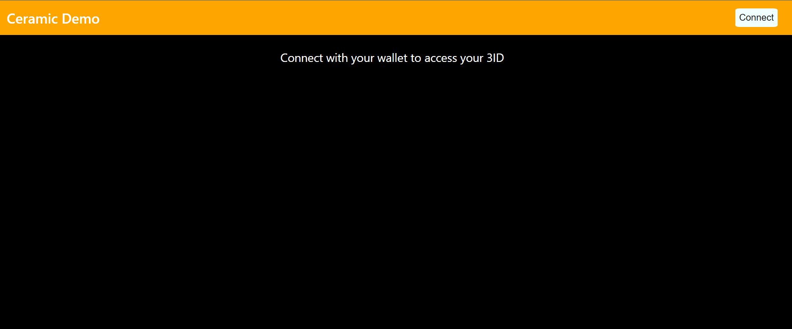
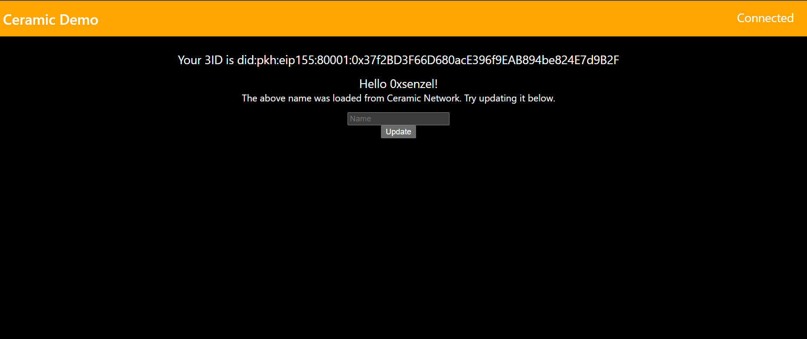

# Build sovereign user profiles using Ceramic Self.ID

This repo contains coursework project from [LearnWeb3](https://learnweb3.io/) completed by [0xsenzel](https://github.com/0xSenzel/) for [LearnWeb3DAO-Junior](https://learnweb3.io/courses/6394ea7c-0ad6-4a4a-879f-7f9756bc5976/lessons) lesson.

## Project Info

Login with Ethereum wallet to view and update your [Ceramic](https://ceramic.network/) Self.ID - a single, high level, library that encapsulates 3ID accounts, creating and setting up a 3ID, underlying calls to Ceramic nodes.

## Project Demo

<figure>

<p align="center">Fig.1 - Home Page</p>
</figure>

<br/>

<figure>

<p align="center">Fig.2 - Display of Self.ID after connected with wallet</p>
</figure>

## Project Setup

### React & Next Js

Under [root](./) folder:

```
npm install
```

To run the app locally:

```
npm run dev
```
